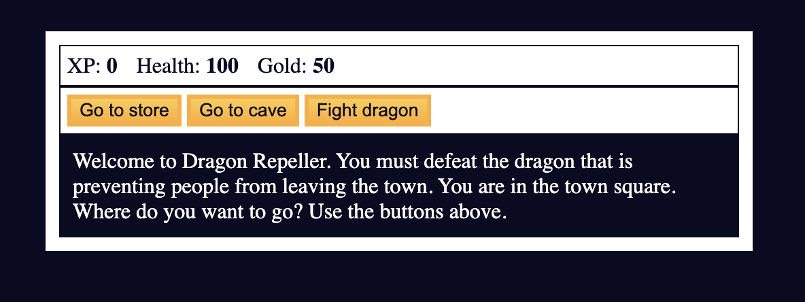

# Dragon Repeller RPG



## 🐉 Overview

Dragon Repeller is a simple text-based RPG adventure game where you must defeat a dragon that's preventing people from leaving town. Navigate through different locations, fight monsters, collect gold, buy weapons, and ultimately defeat the dragon to win the game!

This project was built as part of my JavaScript learning journey through freeCodeCamp's curriculum.

## 🎮 Features

- **Text-based adventure gameplay** with multiple locations to explore
- **Combat system** with different monsters to fight
- **Inventory management** for weapons and items
- **Shop system** to buy health and upgrade weapons
- **Stats tracking** for XP, health, and gold
- **Easter egg mini-game** with a chance to win gold
- **Multiple endings** based on your success or failure

## 🛠️ Technologies Used

- HTML5
- CSS3
- Vanilla JavaScript (no frameworks)

## 🚀 How to Play

1. **Start** in the town square and choose your path
2. **Explore** the store to buy health or upgrade weapons
3. **Visit** the cave to fight monsters and gain experience
4. **Build up** your strength by defeating weaker monsters
5. **Challenge** the dragon once you're powerful enough
6. **Win** the game by defeating the dragon!

## 🎯 Game Mechanics

- **Health**: Starts at 100, decreases when attacked by monsters
- **Gold**: Used to buy health and weapons
- **XP**: Gained by defeating monsters, increases your attack damage
- **Weapons**: More powerful weapons increase your attack damage
  - Stick (5 power)
  - Dagger (30 power)
  - Claw Hammer (50 power)
  - Sword (100 power)
- **Monsters**:
  - Slime (Level 2, 15 health)
  - Fanged Beast (Level 8, 60 health)
  - Dragon (Level 20, 300 health)

## ⚙️ Installation and Setup

1. Clone this repository:
   ```
   git clone https://github.com/yourusername/dragon-repeller.git
   ```
2. Open `index.html` in your web browser

No additional dependencies or build steps required!


## 🤝 Contributing

This is a learning project, but feel free to fork it and make your own improvements!


## 🙏 Acknowledgements

- [freeCodeCamp](https://www.freecodecamp.org/) for the excellent JavaScript curriculum